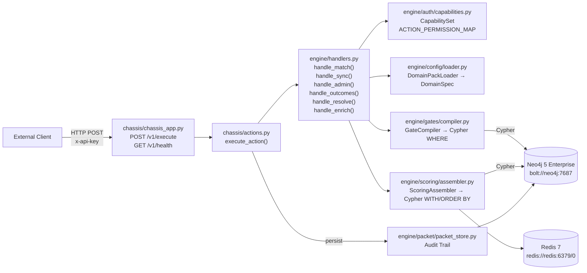

# docs/contracts/

> Production-grade contract documentation for the L9 Cognitive Engine Graph (CEG). Every contract traces back to a specific source file in this repository.

## Architecture Summary

CEG is a **domain-agnostic graph-native matching engine** built on a FastAPI chassis + Neo4j 5 Enterprise + Redis 7 stack. It exposes a **single ingress endpoint** (`POST /v1/execute`) that routes 8 named actions to typed handler functions in `engine/handlers.py`. Behavior is entirely driven by **domain spec YAML files** (`domains/*.yaml`) loaded at runtime via `DomainPackLoader`. The system implements seL4-inspired capability-based access control, PacketEnvelope immutability, and a gate-then-score query architecture.

## Contracts Index

| Contract | Type | Source File | Description |
|----------|------|-------------|-------------|
| `openapi.yaml` | API | `chassis/chassis_app.py`, `chassis/actions.py` | OpenAPI 3.1 spec for all HTTP endpoints |
| `execute-action` | API | `chassis/chassis_app.py` | Universal POST /v1/execute endpoint |
| `health-probe` | API | `chassis/chassis_app.py` | GET /v1/health endpoint |
| `PacketEnvelope` | Data | `engine/packet/packet_envelope.py` | Core immutable message envelope |
| `DomainSpec` | Data | `engine/config/schema.py` | Full domain pack configuration model |
| `OutcomeRecord` | Data | `engine/models/outcomes.py` | Match outcome feedback record |
| `EngineSettings` | Config | `engine/config/settings.py` | All engine environment variables |
| `match-handler` | Agent | `engine/handlers.py` | Gate-then-score traversal action |
| `sync-handler` | Agent | `engine/handlers.py` | Batch MERGE/SET action |
| `admin-handler` | Agent | `engine/handlers.py` | Admin introspection action |
| `outcomes-handler` | Agent | `engine/handlers.py` | Outcome recording action |
| `resolve-handler` | Agent | `engine/handlers.py` | Entity resolution action |
| `enrich-handler` | Agent | `engine/handlers.py` | Property enrichment action |
| `CONTRACT-01..24` | Arch | `contracts/contract_*.yaml` | 24 behavioral invariant contracts |
| `neo4j-dependency` | Dep | `engine/graph/driver.py` | Neo4j 5 Enterprise connection |
| `redis-dependency` | Dep | `docker-compose.yml` | Redis 7 cache layer |

## Dependency Graph



## Validation Commands

```bash
make agent-check                      # everything CI blocks on (contracts included)
pytest tests/contracts/               # contract suite only
```

`make agent-check` is the completion gate: it runs `tools/verify_contracts.py`
(the 20 contract markdown files present and referenced from the agent rule
files), `tools/contract_scanner.py` (banned pattern scan), lint, types, and the
full test suite. A green `agent-check` means green CI.

Run `pytest tests/contracts/` **without** `-m contract`. The `contract` marker
covers under a fifth of the tests in this directory and deselects the rest,
including every OpenAPI, AsyncAPI, JSON Schema, env-contract, dependency, and
auditor-wiring test. Marker-filtered runs pass while most of the contract
surface goes unexercised. To see the split:

```bash
pytest tests/contracts/ -m contract --collect-only    # prints "N/M tests collected (K deselected)"
```

### Known validation gaps

| Surface | Status |
|---------|--------|
| OpenAPI structural lint | `tests/contracts/test_openapi_lint.py` skips — `openapi-spec-validator` is not declared in `pyproject.toml` |
| AsyncAPI schema validation | Only structural key assertions (`test_asyncapi_contract.py`); no full AsyncAPI 3.0 schema check |
| Tool JSON Schemas | `docs/contracts/agents/tool-schemas/` holds only `_index.yaml` — all six action schemas (`match`, `sync`, `admin`, `outcomes`, `resolve`, `enrich`) are `xfail` |
| Shared API schemas | `docs/contracts/api/schemas/shared-models.yaml` and `error-responses.yaml` are not generated — tests `xfail` |

The two schemas under `docs/contracts/data/models/` (`packet-envelope`,
`outcome-record`) **are** validated in-repo by `test_data_models.py`, so no
external `ajv` step is needed — but that test skips when `jsonschema` is absent,
and `jsonschema` is not declared in `pyproject.toml` either. It passes locally
only because the package happens to be installed.

External linters below cover the remaining gaps. They are **not** run by CI and
require Node.js:

```bash
npx @redocly/cli lint docs/contracts/api/openapi.yaml
npx @asyncapi/cli validate docs/contracts/events/asyncapi.yaml
```

## Directory Structure

```
docs/contracts/
├── README.md                    # This file
├── api/
│   └── openapi.yaml            # REST API spec (OpenAPI 3.1)
├── events/
│   └── asyncapi.yaml           # Internal packet events (AsyncAPI 3.0)
├── data/
│   └── graph-schema.yaml       # Neo4j graph schema (system nodes)
├── dependencies/
│   ├── neo4j.yaml              # Neo4j 5 Enterprise connection contract
│   └── redis.yaml              # Redis 7 cache contract
├── config/
│   └── env-contract.yaml       # Environment variables contract
├── agents/
│   └── tool-schemas/           # JSON Schema for each action payload
├── _templates/
│   ├── api-endpoint.template.yaml
│   ├── tool-schema.template.json
│   └── data-model.template.json
└── VERSIONING.md               # Contract versioning policy
```

## Contract Versioning

All contracts follow semantic versioning starting at `1.0.0`. See [VERSIONING.md](./VERSIONING.md) for the full policy.
